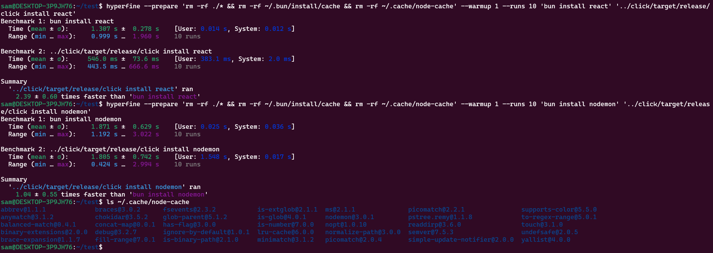

# click

A fast package manager for NodeJS written in Rust.

## How fast?

Benchmark of [bun](https://bun.sh/) vs click **clean install**:

Based on benchmarks done with [hyperfine](https://github.com/sharkdp/hyperfine), click is more or less the same speed as [Bun](https://bun.sh/) for **clean installs**. Due to the nature of HTTP, it is hard to give an accurate answer as to who is "faster", as there are occassions where bun is faster than click. Once caching is implemented, I hope for it to be as fast if not faster than Bun.

## What can it do?

At the moment it can perform an efficient clean install of a package which is stored in the `{CACHE_DIR}/node-cache` folder. This package manager **does not** yet utilize the cache or work as an out of the box package manager, [see here](#whats-missing) for more details.

## Why is it fast?

- Efficient version resolution which minimizes the HTTP throughput by using `{registry}/{package}/{version}` instead of `{registry}/{package}` which has a significantly larger body size
- Use of [reqwest](https://docs.rs/reqwest/latest/reqwest/) to create a HTTP connection pool
- Parallel and asyncronous HTTP requests to the [NPM Registry API](https://github.com/npm/registry/blob/master/docs/REGISTRY-API.md)
- Use of the `Accept: application/vnd.npm.install-v1+json; q=1.0, application/json; q=0.8, */*` header which results in smaller HTTP body sizes
- Duplicate avoidance by storing pre-installed versions in a HashMap for clean installs

## What's missing?

These are the primary functioning features required for this to pass as a "NodeJS package manager". There are plenty more quality of life and utlility features that will be neccessary:

- Use of the cache to avoid re-installing packages
- Creation and maintainence of a `package.json` in the working directory
- Creation and maintainence of a `package-lock.json` in the working directory _as well_ as for each package in the cache
- Creation and maintainence of a `node_modules` folder in the working directory that contains [symlinks](https://en.wikipedia.org/wiki/Symbolic_link) to the cached packages
- An `uninstall` command
- An `update` command
- There is also an off case where some packages contain an operator at the end of their version like this `< version@2.2.3 > 1.1.2` which is not tolerated by [semver](https://docs.rs/semver/latest/semver/)
- Use checksums to verify file downloads
- Proper error handling everywhere